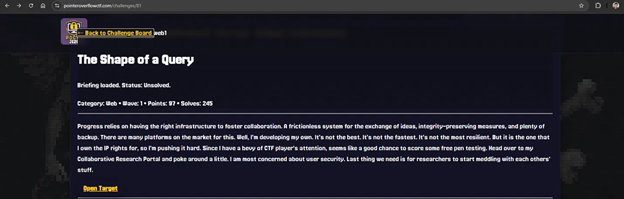
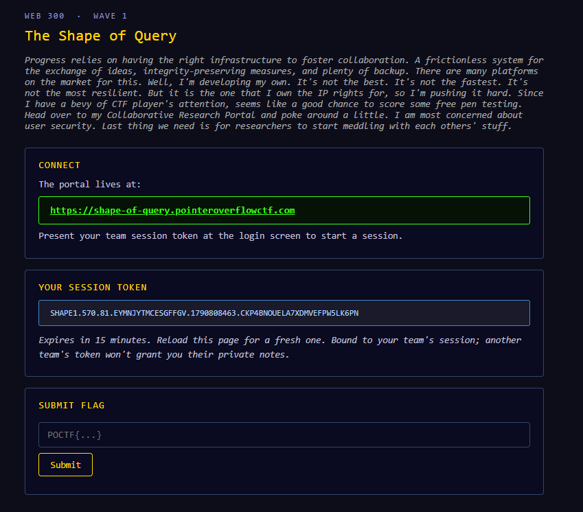
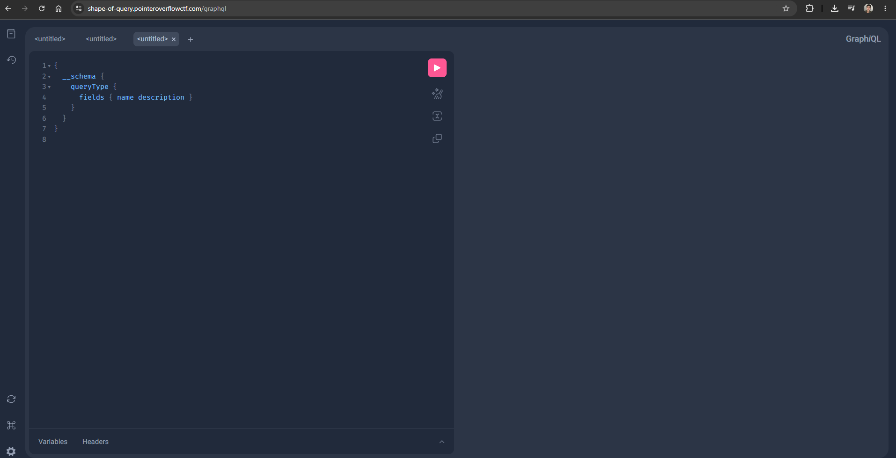
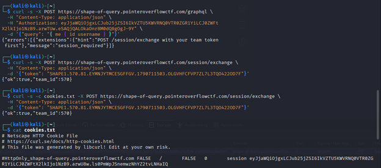
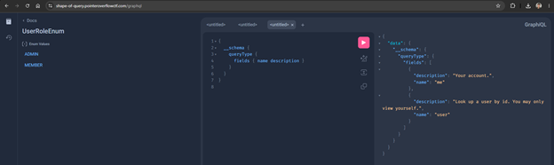
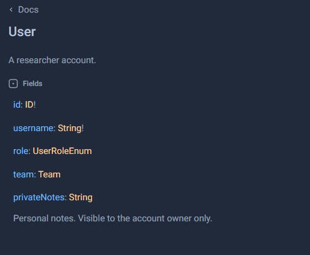
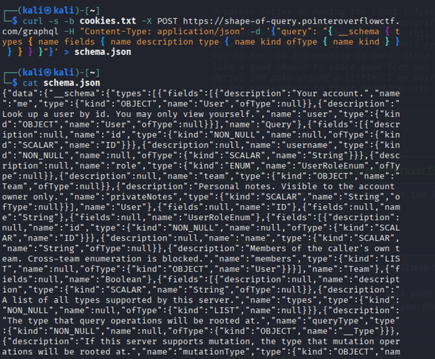
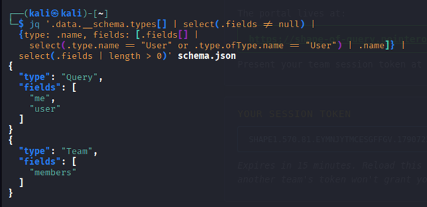
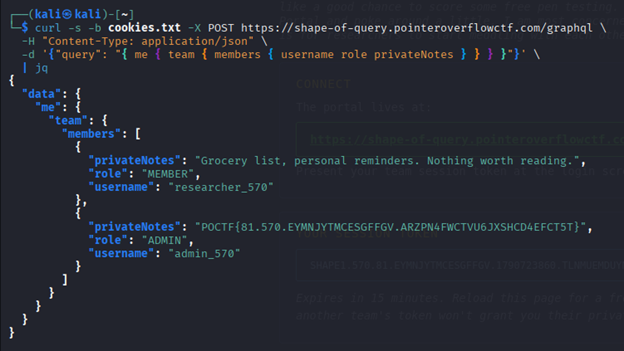
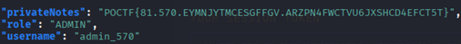

# Write-up: The Shape of a Query (Web)



## Introducción

Este reto consistió en explotar una API GraphQL de un portal de investigación colaborativa para acceder a información privada de otro usuario del mismo equipo. La vulnerabilidad explotada fue un caso de **Broken Object Level Authorization (BOLA / IDOR)**, donde el acceso a un recurso estaba restringido solo en algunas rutas pero no en otras.


## Descripción del reto



Se nos entregó acceso a una aplicación web con una sesión válida por 15 minutos y una URL del portal `https://shape-of-query.pointeroverflowctf.com`. El objetivo era obtener datos privados de otro miembro del mismo equipo usando la API GraphQL del servicio.


Página al iniciar sesión con el token



## Proceso de resolución

### 1. Autenticación contra la API

El token de sesión no se podía usar directamente como header de autorización. Primero había que intercambiarlo en el endpoint `/session/exchange`, que devolvía una cookie de sesión válida para la API.

```bash
curl -s -c cookies.txt -X POST https://shape-of-query.pointeroverflowctf.com/session/exchange \
  -H "Content-Type: application/json" \
  -d '{"token": "<TOKEN_DE_SESION_DEL_EQUIPO>"}'
```

Salida de la terminal al intentar usar el header incorrectamente y luego de manera correcta:




### 2. Exploración del schema con GraphiQL



La API tenía habilitada la introspección de GraphQL. Desde la interfaz GraphiQL del portal se descubrieron tipos como `User`, `Team` y `UserRoleEnum`. El campo `privateNotes` del tipo `User` llamó la atención porque estaba documentado como visible únicamente para el dueño de la cuenta.




### 3. Volcado completo del schema

Para estudiar el schema de forma más sistemática, se realizó una introspección completa y se guardó el resultado en un archivo JSON.

Comando utilizado:

```bash
curl -s -b cookies.txt -X POST https://shape-of-query.pointeroverflowctf.com/graphql \
  -H "Content-Type: application/json" \
  -d '{"query": "{ __schema { types { name fields { name description type { name kind ofType { name kind } } } } } }"}' \
  > schema.json
```

Salida del comando en la terminal:



### 4. Mapeo de rutas de acceso con `jq`

Se filtró el JSON para ver por cuántos caminos distintos se podía llegar al tipo `User`.

Comando utilizado:

```bash
jq '.data.__schema.types[] | select(.fields != null) |
  {type: .name, fields: [.fields[] |
    select(.type.name == "User" or .type.ofType.name == "User") | .name]} |
  select(.fields | length > 0)' schema.json
```

Salida del comando en la terminal:



El resultado mostró dos rutas hacia `User`: la query de nivel superior (`me`, `user`) y una ruta anidada, `Team.members`. La query `user(id)` tenía una restricción de acceso que indicaba que solo se podía ver el propio perfil, pero esa misma validación no aparecía en `Team.members`.


### 5. Explotación

Se armó una consulta anidada para acceder a `me -> team -> members` y solicitar el campo `privateNotes` de todos los miembros del equipo. Como la autorización no se verificaba por cada `User` individual, el servidor devolvió las notas privadas de otros usuarios, incluyendo la del usuario con rol `ADMIN`.

Consulta armada para solicitar `privateNotes` de todos los usuarios:

```bash
curl -s -b cookies.txt -X POST https://shape-of-query.pointeroverflowctf.com/graphql \
  -H "Content-Type: application/json" \
  -d '{"query": "{ me { team { members { username role privateNotes } } } }"}' \
  | jq
```

Salida de la consulta en la terminal:



### 6. Automatización del exploit (`solve.py`)

Una vez validada manualmente la cadena de explotación (intercambio de sesión + query anidada `me -> team -> members`), se escribió el script `solve.py` para automatizar todo el proceso en una sola ejecución, sin tener que repetir los comandos `curl` a mano cada vez.

El script hace, en orden, exactamente los mismos dos pasos que se hicieron manualmente en los puntos 1 y 5:

1. **Intercambia el token de sesión por una cookie válida** (`exchange_session`), reproduciendo la llamada a `/session/exchange` del Paso 1, pero manteniendo la sesión autenticada en un objeto `requests.Session()` para no tener que gestionar el archivo `cookies.txt` a mano.
2. **Envía la query de explotación** (`run_graphql` con `EXPLOIT_QUERY`), que es la misma consulta `{ me { team { members { username role privateNotes } } } }` armada en el Paso 5.
3. **Recorre la lista de miembros devuelta** y busca automáticamente al usuario con `role == "ADMIN"`, imprimiendo su `privateNotes` (donde está la flag) sin que haya que leerlo a mano del JSON de respuesta.

En otras palabras, `solve.py` no agrega ninguna técnica nueva respecto de lo explicado en los pasos anteriores pero permite volver a obtener la flag con un solo comando, pasándole un token de sesión vigente como argumento:

```bash
python3 solve.py <TOKEN_DE_SESION_DEL_EQUIPO>
```


## Validación y flag

Al combinar el análisis del schema con la explotación de la ruta no protegida, se obtuvo la flag final:



Flag obtenida:

**POCTF{81.570.EYMNJYTMCESGFFGV.ARZPN4FWCTVU6JXSHCD4EFCT5T}**


## Conclusión

La vulnerabilidad consistió en que el control de acceso estaba implementado solo en la query `user(id)`, pero no en la resolución de `privateNotes` al acceder a los miembros del equipo a través de `Team.members`. Esto permitió leer información privada de otro usuario del mismo equipo y obtener la flag final. El script `solve.py`, incluido junto a este writeup, automatiza la cadena de explotación completa (intercambio de sesión + query anidada) como prueba de concepto reproducible.
