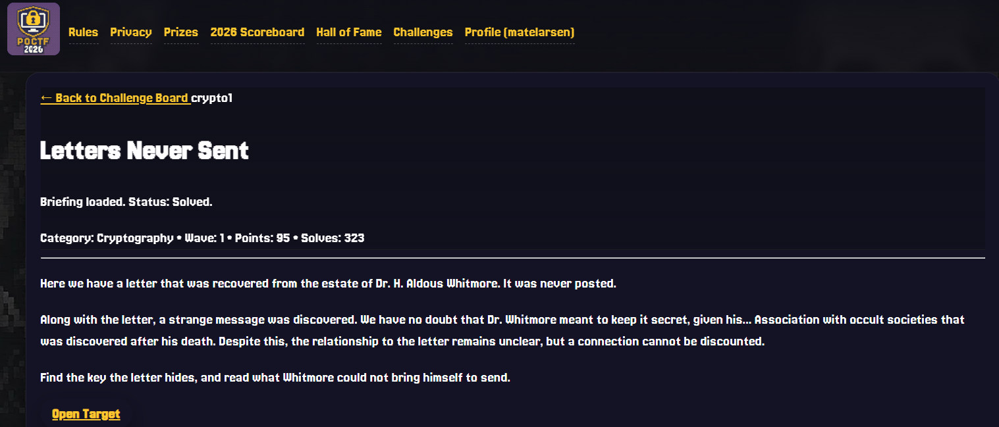
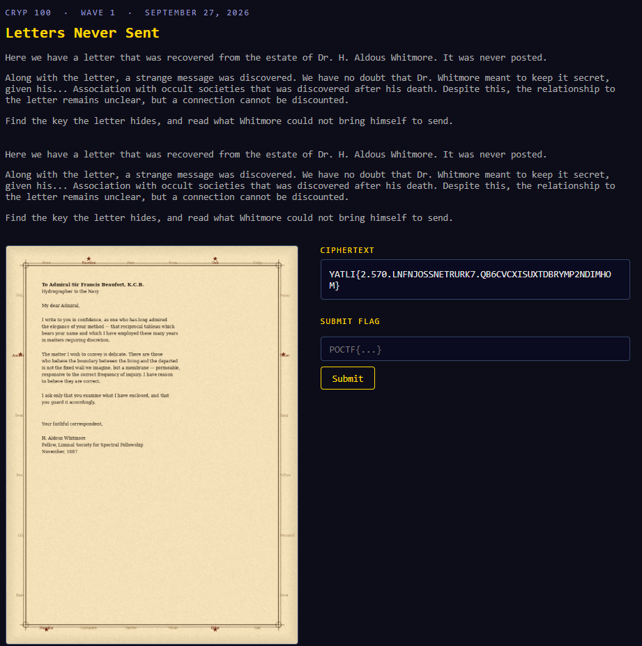
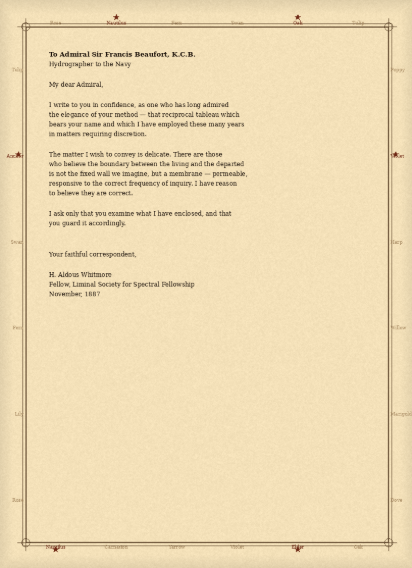
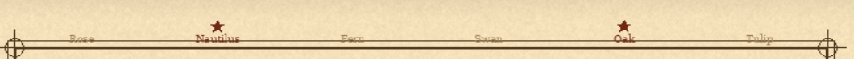
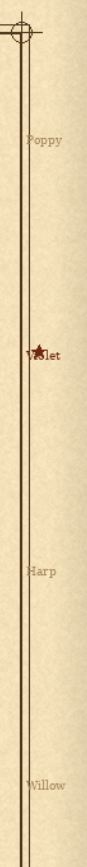
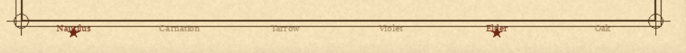
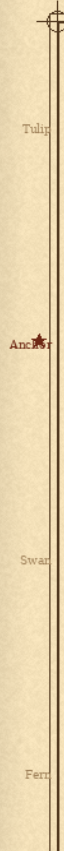
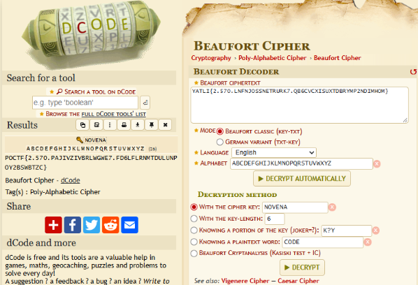
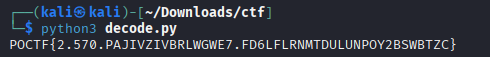
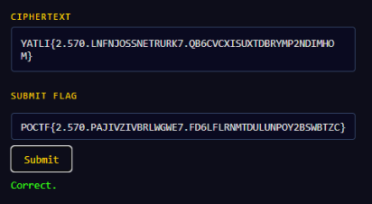

# Write-up: Letters Never Sent (Cryptography)

## Introducción

El reto **"Letters Never Sent"** de POCTF consistía en descifrar un texto cifrado a partir de varias pistas incluidas en el propio desafío.

El ciphertext proporcionado era:

```text
YATLI{2.570.LNFNJOSSNETRURK7.QB6CVCXISUXTDBRYMP2NDIMHOM}
```

Sabíamos además que la flag final debía comenzar con el formato habitual:

```text
POCTF{...}
```





## Proceso de resolución

### 1. Análisis de las pistas

El desafío incluía una carta dirigida a **Sir Francis Beaufort**.

Dentro del texto aparecía además una referencia a:

> "that reciprocal tableau which bears your name"

Esta frase era una pista importante, ya que Francis Beaufort da nombre al **cifrado Beaufort**, un cifrado clásico relacionado con Vigenère.



### 2. Obtención de la clave

Además de la carta, había varias palabras marcadas con **estrellas rojas** alrededor del desafío.

Leyéndolas en el orden correspondiente, las letras destacadas formaban:

```text
NOVENA
```

Por lo tanto, tomamos:

```text
Clave = NOVENA
```









### 3. Identificación del cifrado

Con las dos pistas principales:

- referencia directa a **Francis Beaufort**;
- clave escondida **NOVENA**;

probamos el ciphertext utilizando el **cifrado Beaufort clásico**.

Para una letra, el descifrado puede expresarse como:

```text
P = (K - C) mod 26
```

donde:

- `P` es la letra del texto plano;
- `K` es la letra correspondiente de la clave;
- `C` es la letra del ciphertext.

Los caracteres que no pertenecen al alfabeto, como `{`, `}`, números y puntos, se mantienen sin cambios.

### 4. Descifrado con dCode

Como primera comprobación utilizamos el decoder de **Beaufort Cipher** de dCode.

Configurando:

```text
Cipher: Beaufort
Key: NOVENA
```

se obtuvo:

```text
POCTF{2.570.PAJIVZIVBRLWGWE7.FD6LFLRNMTDULUNPOY2BSWBTZC}
```



### 5. Script en Python

Para que la solución fuera reproducible sin depender de una herramienta online, implementamos también el descifrado en Python.

```python
ciphertext = "YATLI{2.570.LNFNJOSSNETRURK7.QB6CVCXISUXTDBRYMP2NDIMHOM}"
key = "NOVENA"

result = []
key_index = 0

for char in ciphertext:
    if char.isalpha():
        c = ord(char.upper()) - ord("A")
        k = ord(key[key_index % len(key)]) - ord("A")

        p = (k - c) % 26

        result.append(chr(p + ord("A")))
        key_index += 1
    else:
        result.append(char)

print("".join(result))
```

La salida del script es:

```text
POCTF{2.570.PAJIVZIVBRLWGWE7.FD6LFLRNMTDULUNPOY2BSWBTZC}
```



## Flag

```text
POCTF{2.570.PAJIVZIVBRLWGWE7.FD6LFLRNMTDULUNPOY2BSWBTZC}
```



## Conclusión

El reto se resolvió combinando las pistas visuales y textuales del desafío.

La referencia a **Sir Francis Beaufort** permitió identificar el algoritmo criptográfico, mientras que las letras señaladas por las estrellas rojas revelaron la clave **NOVENA**.

Aplicando el cifrado Beaufort clásico al ciphertext se recuperó correctamente la flag. El script en Python permite reproducir el proceso completo de descifrado sin depender de herramientas externas.
