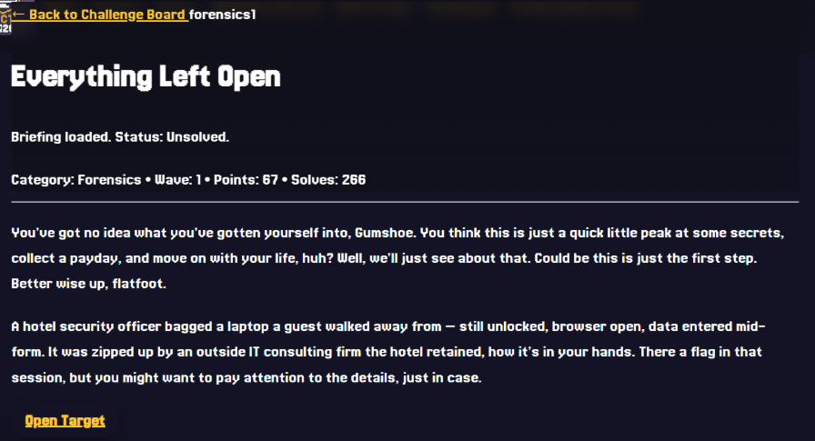
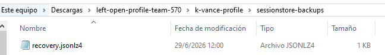
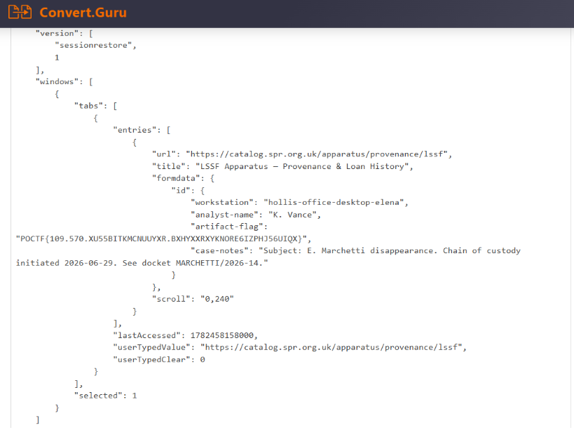
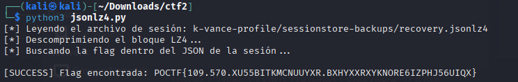
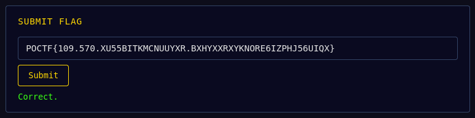

# Write-up: Everything Left Open (Forensics)

## Introducción

El desafío **"Everything Left Open"** pertenecía a la categoría **Forensics**.  
El objetivo era recuperar una flag con el formato:

```text
POCTF{...}
```

El enunciado indicaba que el equipo había sido recuperado con el navegador abierto y que existían datos ingresados a medio completar en un formulario. Esto sugería que la información buscada podía encontrarse en el estado de la sesión del navegador.



## Descripción del reto

Al descomprimir el archivo proporcionado por el desafío se obtuvo la estructura de un perfil de usuario de **Mozilla Firefox**, identificado por la carpeta:

```text
k-vance-profile/
```

Dentro del perfil aparecían distintos archivos característicos del navegador, entre ellos:

```text
places.sqlite
logins.json
formhistory.sqlite
sessionstore-backups/
```

Las pistas principales eran:

- El equipo fue recuperado con el navegador abierto.
- Había información ingresada a medio completar en un formulario.
- La flag se encontraba dentro de esa sesión abierta.

## Proceso de resolución

### 1. Inspección del perfil de Firefox

El primer paso fue revisar la estructura del perfil y determinar qué archivos podían contener información útil.

Algunos de los archivos relevantes eran:

- `places.sqlite`: historial de navegación y marcadores.
- `formhistory.sqlite`: historial relacionado con formularios.
- `sessionstore-backups/recovery.jsonlz4`: estado de recuperación de la sesión del navegador.

La pista sobre un formulario que había quedado abierto hizo especialmente interesante el archivo:

```text
sessionstore-backups/recovery.jsonlz4
```

Este archivo contenía información correspondiente al estado de la sesión recuperada.

<!-- Agregar captura de los archivos del perfil -->


### 2. Análisis de `recovery.jsonlz4`

El archivo `recovery.jsonlz4` no podía leerse directamente como un JSON normal.

Su contenido estaba comprimido y comenzaba con la cabecera utilizada por Firefox:

```text
mozLz40\0
```

Después de esos primeros 8 bytes se encontraba el bloque comprimido con **LZ4**.

Por lo tanto, para inspeccionar correctamente la sesión era necesario:

1. Leer el archivo en modo binario.
2. Omitir los primeros 8 bytes correspondientes a la cabecera.
3. Descomprimir el resto mediante LZ4.
4. Convertir el resultado nuevamente a texto.
5. Buscar dentro del JSON resultante la flag.

### 3. Primera extracción de la sesión

Durante la resolución se utilizó una herramienta online para descomprimir el archivo `recovery.jsonlz4`.

Una vez obtenido el contenido de la sesión se pudo identificar el campo:

```text
artifact-flag
```

con el valor:

```text
POCTF{109.570.XU55BITKMCNUUYXR.BXHYXXRXYKNORE6IZPHJ56UIQX}
```



### 4. Automatización con Python

Para hacer la solución reproducible también se utilizó el script:

```text
jsonlz4.py
```

El script requiere la librería `lz4`, que puede instalarse con:

```bash
pip install lz4
```

El archivo esperado por el script se encuentra en:

```text
k-vance-profile/sessionstore-backups/recovery.jsonlz4
```

La parte principal del proceso consiste en eliminar la cabecera de 8 bytes y descomprimir el bloque restante:

```python
with open(jsonlz4_path, "rb") as f:
    content = f.read()

compressed_data = content[8:]

decompressed_bytes = lz4.block.decompress(compressed_data)
json_str = decompressed_bytes.decode("utf-8", errors="ignore")
```

Después se busca automáticamente una cadena con el formato de la flag:

```python
flag_match = re.search(r'POCTF\{[^}]+\}', json_str)
```

Para ejecutar el script:

```bash
python jsonlz4.py
```

Si la flag se encuentra correctamente, el programa muestra:

```text
[SUCCESS] Flag encontrada: POCTF{109.570.XU55BITKMCNUUYXR.BXHYXXRXYKNORE6IZPHJ56UIQX}
```



## Flag

```text
POCTF{109.570.XU55BITKMCNUUYXR.BXHYXXRXYKNORE6IZPHJ56UIQX}
```



## Conclusión

El desafío se resolvió analizando el estado de recuperación de una sesión de **Mozilla Firefox**.

La pista principal apuntaba a información que había quedado cargada en un formulario mientras el navegador continuaba abierto. Esto llevó al archivo `sessionstore-backups/recovery.jsonlz4`, que almacenaba el estado de la sesión en un formato comprimido.

Después de retirar la cabecera `mozLz40\0` y descomprimir el contenido con LZ4, fue posible inspeccionar los datos de la sesión y encontrar la flag.

El script `jsonlz4.py` permite reproducir de forma automática todo el proceso de extracción y búsqueda.
