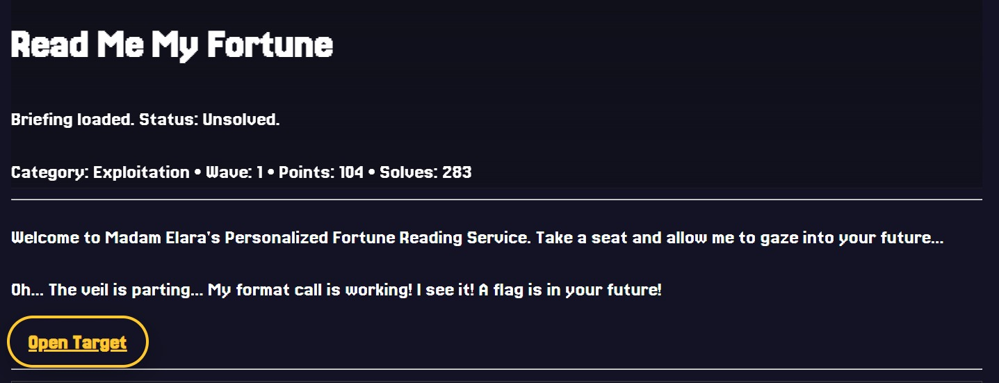
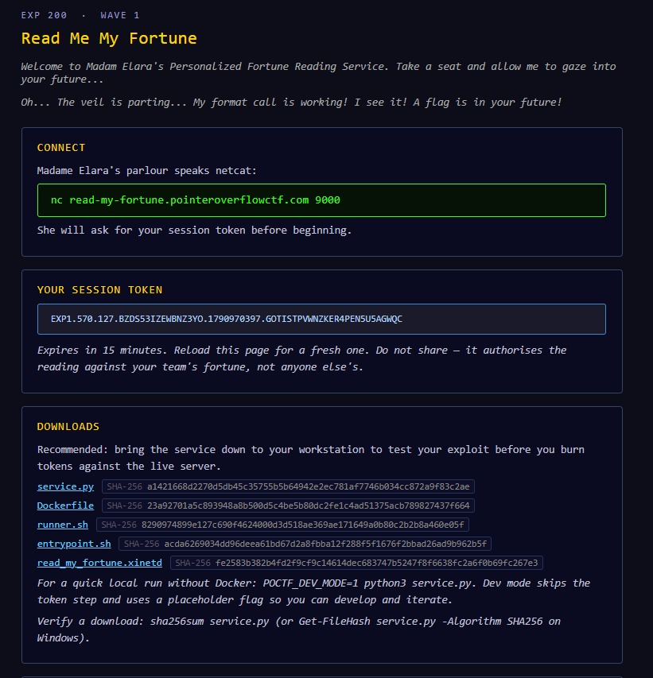
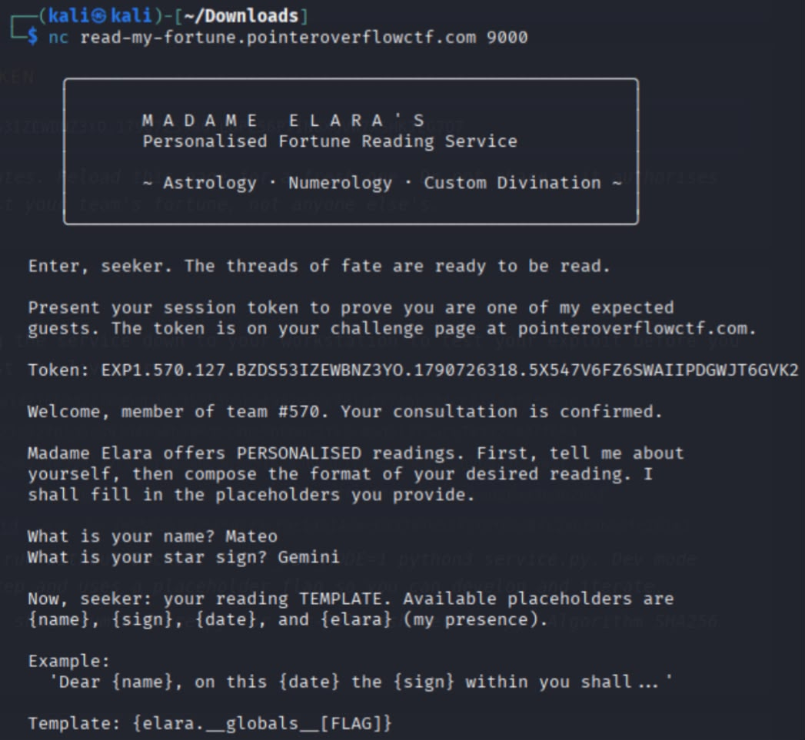
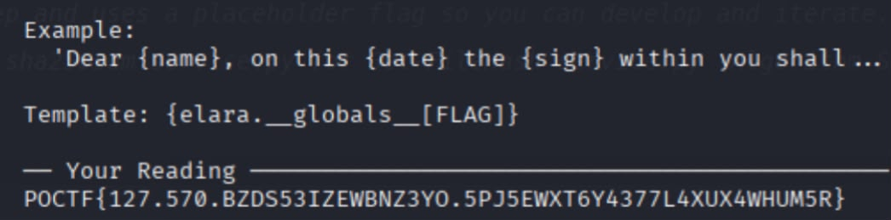
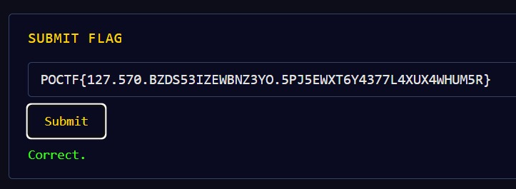

# Write-up: Read Me My Fortune (Exploitation)



## Introducción




Este reto consistió en vulnerar un servicio de "lectura de fortuna" al que nos conectábamos mediante Netcat. La vulnerabilidad explotada fue un **Server-Side Template Injection (SSTI)** a través del método `str.format()` de Python, lo que nos permitió acceder a variables globales del servidor y extraer la flag.

## Descripción del reto

Se nos entregó un servicio corriendo por TCP (accesible vía `nc`) y nos proporcionaron el código fuente completo del servicio (`service.py`, `Dockerfile`, etc.) y un token de sesión. El objetivo era lograr que el servicio nos revelara la flag del equipo, la cual se generaba dinámicamente al validar nuestra sesión.

## Proceso de resolución

### 1. Análisis del código fuente

Lo primero fue revisar el archivo `service.py` para entender cómo funcionaba el programa. Al inspeccionar la función `main()`, encontramos la parte donde el servicio interactúa con el usuario y genera la respuesta:

```python
template = _read("  Template: ", max_len=2048)
...
reading = template.format(
    name=name, sign=sign, date=date, elara=_greet,
)
```

Al analizar esto, destacaron dos cosas importantes:
1. El input del usuario (`template`) no está sanitizado; nosotros controlamos exactamente qué texto se formatea.
2. Dentro de la función `format()`, se pasan variables normales como `name` o `sign` (que son simples strings), pero también se pasa `elara=_greet`. 

### 2. Identificando la vulnerabilidad

La clave del reto estaba en `elara`. Mientras que las otras variables son texto plano, `_greet` es una **función** de Python. 

La sintaxis de formateo de Python (`{placeholder}`) permite hacer mucho más que imprimir variables; permite navegar por los atributos de un objeto usando puntos. Como `elara` es una función, hereda características propias de los objetos de Python, entre ellas el atributo `__globals__`, el cual es un diccionario que contiene todas las variables globales del módulo donde se definió la función.

Sabiendo que la variable `FLAG` estaba definida globalmente en el script, la ruta de explotación era clara:
- `{elara}` llama a la función.
- `{elara.__globals__}` accede al diccionario de variables globales del script.
- `{elara.__globals__[FLAG]}` extrae específicamente el valor de la variable llamada "FLAG".

### 3. Pruebas en entorno local

El código fuente incluía un modo de desarrollo. Para no gastar intentos en el servidor real y comprobar nuestra teoría, levantamos el servicio localmente salteando la verificación del token:

```bash
export POCTF_DEV_MODE=1
python3 service.py
```

Al ingresar nuestro payload `{elara.__globals__[FLAG]}` como plantilla, el servicio local nos devolvió la flag de prueba, confirmando que la vulnerabilidad era explotable.

### 4. Explotación remota

Con el payload validado, nos conectamos al servidor del CTF por Netcat. Proporcionamos nuestro token de sesión, llenamos los datos básicos y, al momento de pedirnos el "Template", enviamos nuestra inyección:

```bash
nc read-my-fortune.pointeroverflowctf.com 9000
```


*(Enviando la plantilla maliciosa `{elara.__globals__[FLAG]}` al servidor)*

El servidor procesó el formateo, navegó por los atributos de la función `elara` y renderizó el contenido de la variable global, entregándonos la flag.


*(El servicio devuelve la flag renderizada en la respuesta)*

## Validación y flag

Al aprovechar el objeto no primitivo pasado al contexto de formateo, se obtuvo la flag final:

**POCTF{127.570.BZDS53IZEWBNZ3YO.5PJ5EWXT6Y4377L4XUX4WHUM5R}**


Entrega de la flag:


## Conclusión

La vulnerabilidad ocurrió porque se combinó una plantilla controlada al 100% por el usuario con un contexto de `format()` que incluía un objeto complejo (una función). En Python, pasar objetos como funciones o clases a un `str.format()` inseguro equivale a darle al usuario la llave para navegar por los atributos internos del programa y, en este caso, leer información sensible almacenada en la memoria global.